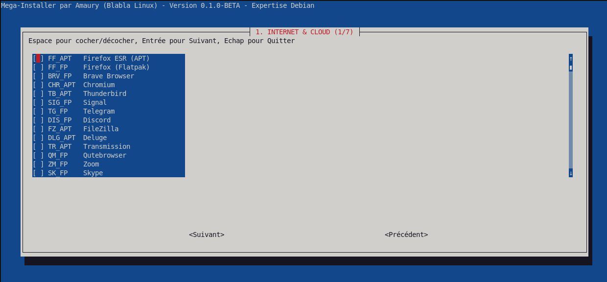

## 📦 Mega-Blabla-Installer

  
  
  


**L'outil de post-installation ultime pour les techniciens et utilisateurs Debian.** Développé par **Amaury (Blabla Linux)**, ce script automatise l'installation de plus de 90 logiciels sur Debian 11/12 (Stable) via une interface interactive.

> [!IMPORTANT]  
> **Note sur la version Beta** : Ce script est actuellement en phase **Beta (v0.1.0)**. Il est pleinement fonctionnel mais sujet à des évolutions majeures (structure du code, enrichissement du catalogue). Vos retours sont précieux pour l'améliorer !

## 👨‍💻 À propos de l'auteur

Administrateur système spécialisé dans le reconditionnement matériel sous Linux, je milite pour une informatique durable et libre. Ce script est le fruit de mon expertise sur le terrain pour faciliter le déploiement de stations de travail performantes et prêtes à l'emploi.

👉 **Un seul lien :** [link.blablalinux.be](https://link.blablalinux.be)

## 🚀 Installation et Lancement

Pour garantir une stabilité parfaite de l'interface graphique (**Whiptail**) et une prise en charge totale de votre clavier (touches fléchées et espace), le script doit être téléchargé et exécuté localement :

### Option 1 : Via GitHub (Recommandé)

```plaintext
# 1. Télécharger le script
wget https://raw.githubusercontent.com/anyblabla/mega-blabla-installer/main/mega-blabla-installer.sh

# 2. Rendre le fichier exécutable
chmod +x mega-blabla-installer.sh

# 3. Lancer l'installateur
sudo ./mega-blabla-installer.sh
```

### Option 2 : Via Gitea (Blabla Linux)

```plaintext
# 1. Télécharger le script
wget https://gitea.blablalinux.be/blablalinux/mega-blabla-installer/raw/branch/main/mega-blabla-installer.sh

# 2. Rendre le fichier exécutable
chmod +x mega-blabla-installer.sh

# 3. Lancer l'installateur
sudo ./mega-blabla-installer.sh
```

## ✨ Visuel



## ⚡ Pourquoi utiliser cet outil ?

L'installation manuelle et individuelle de logiciels après une installation fraîche de Debian peut être chronophage. Le **Mega-Blabla-Installer** centralise les meilleures applications du monde libre dans une interface simplifiée et ergonomique.

### 🛠️ Une gestion hybride intelligente

Le script combine deux méthodes de distribution pour garantir stabilité et modernité :

*   **APT (Dépôts Debian)** : Privilégié pour les outils système, les utilitaires de base et les logiciels nécessitant une intégration profonde.
*   **Flatpak (Flathub)** : Utilisé pour les applications "utilisateur" afin de bénéficier des versions les plus récentes sans impacter la stabilité du cœur Debian.

### 📂 Un catalogue organisé (+90 logiciels)

Le catalogue est structuré en **7 catégories thématiques** pour une sélection sur mesure :

1.  **Internet & Cloud** : Navigateurs (Firefox, Brave, Edge), Messageries (Signal, Discord, Telegram), Cloud (Nextcloud, Dropbox).
2.  **Bureautique & Notes** : Suites Office (LibreOffice, OnlyOffice), éditeurs PDF, Obsidian, Joplin.
3.  **Graphisme & Design** : GIMP, Inkscape, Blender, FreeCAD, Darktable.
4.  **Multimédia & Création** : VLC, MPV, Kdenlive, Audacity, OBS Studio.
5.  **Développement & Code** : VS Code, Vim, Docker, Android Studio, NodeJS.
6.  **Système & Admin** : Btop, Stacer, GParted, Virt-Manager, Timeshift, Nmap.
7.  **Éducation & Jeux** : GCompris, Scratch, Steam, Lutris, RetroArch.

## ⚙️ Fonctionnement technique

Le script repose sur **Whiptail** pour offrir une interface utilisateur TUI (_Text User Interface_) robuste :

*   **Navigation non-linéaire** : Revenez en arrière pour modifier vos choix avant l'installation.
*   **Auto-configuration** : Vérification de `flatpak`, activation de `flathub` et mise à jour APT automatiques.
*   **Respect du système** : Aucune modification n'est effectuée sans votre validation finale dans le menu de résumé.

## 🔗 Liens du projet

*   **Dépôt GitHub :** 👉 [https://github.com/anyblabla/mega-blabla-installer](https://github.com/anyblabla/mega-blabla-installer)
*   **Dépôt Gitea :** 👉 [https://gitea.blablalinux.be/blablalinux/mega-blabla-installer](https://gitea.blablalinux.be/blablalinux/mega-blabla-installer)

## 📄 Licence

Ce projet est distribué sous licence **GPLv3**. Vous êtes libre de l'utiliser, de le modifier et de le partager.

_Fait avec passion par Amaury (BlablaLinux) pour la communauté Debian._

[def]: mega-blabla-installer.jpg
[def2]: /mega-blabla-installer/mega-blabla-installer.jpg
